# Mermaid Diagrams for Presentation
# Render these on draw.io by selecting "Insert > Advanced > Mermaid"

## DIAGRAM 1: Algorithm Flowchart
## File: algorithm_flowchart.mmd

```mermaid
flowchart TD
    Start([Start: Cover Image + Payload])
    
    Start --> EdgeMap[Compute Edge Map<br/>Sobel Edge Detection]
    EdgeMap --> Partition[Partition into 8×8 Blocks]
    Partition --> Score[Calculate Edge Score<br/>for Each Block]
    Score --> Sort[Sort Blocks by<br/>Edge Intensity DESC]
    
    Sort --> UBLB[Embed UB/LB in<br/>First 16 Pixels]
    UBLB --> Length[Embed Payload Length<br/>32 bits]
    
    Length --> LoopStart{More<br/>Blocks?}
    LoopStart -->|Yes| CheckEdge{Edge Score<br/>≥ Threshold?}
    CheckEdge -->|No| LoopStart
    
    CheckEdge -->|Yes| ComputeMe[Compute Mean-of-Medians Me<br/>Median of each column → Mean]
    ComputeMe --> PixelPair{More Pixel<br/>Pairs?}
    
    PixelPair -->|Yes| CheckDiff{Di = |p1-p2|<br/>≤ Me?}
    CheckDiff -->|No| PixelPair
    
    CheckDiff -->|Yes| MSBCase[Determine MSB Case<br/>0: 0,0 → 2 bits<br/>1: 1,0 → 3 bits<br/>2: 0,1 → 3 bits<br/>3: 1,1 → 4 bits]
    MSBCase --> Embed[Embed Bits in<br/>Appropriate Positions]
    Embed --> PixelPair
    
    PixelPair -->|No| LoopStart
    LoopStart -->|No| Save[Save Stego Image]
    Save --> End([End])
    
    style Start fill:#e1f5ff
    style End fill:#e1f5ff
    style Embed fill:#d4edda
    style MSBCase fill:#fff3cd
    style CheckEdge fill:#f8d7da
    style CheckDiff fill:#f8d7da
```

## DIAGRAM 2: Security Layers
## File: security_layers.mmd

```mermaid
flowchart TB
    Input["🔤 Secret Message"] --> Layer1
    
    subgraph Layer1["🔐 Layer 1: Encryption"]
        AES["AES-256-CTR<br/>256-bit key"]
    end
    
    Layer1 --> Layer2
    
    subgraph Layer2["🖼️ Layer 2: Steganography"]
        Stego["Adaptive LSB-MSB<br/>Multi-bit embedding"]
    end
    
    Layer2 --> Layer3
    
    subgraph Layer3["✨ Layer 3: Edge-Adaptive"]
        Edge["Sobel edge detection<br/>High-gradient priority"]
    end
    
    Layer3 --> Output["✅ Secure Stego Image"]
    
    style Input fill:#e3f2fd,stroke:#1976d2,stroke-width:3px
    style Layer1 fill:#ffcdd2,stroke:#c62828,stroke-width:2px
    style AES fill:#ef5350,stroke:#c62828,stroke-width:2px,color:#fff
    style Layer2 fill:#fff9c4,stroke:#f57f17,stroke-width:2px
    style Stego fill:#fdd835,stroke:#f57f17,stroke-width:2px
    style Layer3 fill:#b3e5fc,stroke:#0277bd,stroke-width:2px
    style Edge fill:#29b6f6,stroke:#0277bd,stroke-width:2px
    style Output fill:#c8e6c9,stroke:#2e7d32,stroke-width:3px
```



## DIAGRAM 3: System Architecture
## File: system_architecture.mmd

```mermaid
graph TB
    subgraph UI[User Interface Layer]
        MainProg[main.py<br/>Interactive Program]
        RunSteg[run_steganalysis.py<br/>Steganalysis Runner]
        Compare[compare_methods.py<br/>Comparison Tool]
    end
    
    subgraph Core[Core Functionality Layer]
        AdaptiveSteg[adaptive_stego.py<br/>• Edge Detection Sobel<br/>• 8×8 Block Decomposition<br/>• Mean-of-Medians<br/>• MSB Cases 0-3<br/>• Adaptive Embedding]
        
        AESCTR[AESCTR.py<br/>• AES-256-CTR<br/>• Key Generation<br/>• Encryption<br/>• Decryption]
        
        Metrics[metricscalc.py<br/>• PSNR / MSE<br/>• Entropy<br/>• Capacity<br/>• Histogram Deviation]
        
        Steganalysis[steganalysis.py<br/>• RS Analysis<br/>• Histogram Analysis<br/>• Chi-Square Attack]
        
        BasicLSB[steno.py<br/>Basic LSB<br/>For Comparison]
    end
    
    subgraph Libs[Supporting Libraries]
        OpenCV[OpenCV cv2]
        NumPy[NumPy]
        Matplotlib[Matplotlib]
        Crypto[PyCryptodome]
    end
    
    MainProg --> AESCTR
    MainProg --> AdaptiveSteg
    MainProg --> Metrics
    
    RunSteg --> Steganalysis
    
    Compare --> AESCTR
    Compare --> AdaptiveSteg
    Compare --> BasicLSB
    Compare --> Metrics
    Compare --> Steganalysis
    
    AdaptiveSteg --> OpenCV
    AdaptiveSteg --> NumPy
    AESCTR --> Crypto
    Metrics --> OpenCV
    Metrics --> NumPy
    Steganalysis --> Matplotlib
    
    style UI fill:#e1f5ff
    style Core fill:#fff4e6
    style Libs fill:#f0f0f0
    style AdaptiveSteg fill:#d4edda
    style AESCTR fill:#ffe6e6
```



## DIAGRAM 4: Embedding Data Flow
## File: embedding_flow.mmd

```mermaid
flowchart LR
    A[Secret Message] --> B[AES-CTR<br/>Encryption]
    B --> C[Encrypted Payload<br/>nonce + ciphertext]
    
    D[Cover Image] --> E[Edge Detection<br/>Sobel Operator]
    E --> F[Edge Map<br/>Gradient Magnitude]
    
    C --> G[Adaptive<br/>Steganography]
    D --> G
    F --> G
    
    G --> H[8×8 Block<br/>Decomposition]
    H --> I[Sort Blocks by<br/>Edge Intensity]
    I --> J[Embed UB/LB<br/>Metadata]
    J --> K[Mean-of-Medians<br/>Computation]
    K --> L[MSB Case<br/>Determination]
    L --> M[Multi-bit<br/>Embedding]
    M --> N[Stego Image]
    
    style A fill:#ffe6e6
    style B fill:#ffe6e6
    style C fill:#ffe6e6
    style D fill:#e1f5ff
    style N fill:#d4edda
    style G fill:#fff3cd
```



## DIAGRAM 5: Extraction Data Flow
## File: extraction_flow.mmd


## DIAGRAM 6: Quality Metrics Comparison
## File: quality_comparison.mmd

```mermaid
%%{init: {'theme':'base'}}%%
graph TD
    subgraph Comparison[Quality Metrics Comparison]
        direction TB
        
        subgraph BasicLSB[Basic LSB]
            B1[PSNR: 45-48 dB]
            B2[MSE: 5-10]
            B3[Entropy Diff: 0.2-0.4]
            B4[Histogram: 0.05-0.1]
        end
        
        subgraph Adaptive[Adaptive LSB-MSB]
            A1[PSNR: 48-52 dB]
            A2[MSE: 2-5]
            A3[Entropy Diff: 0.1-0.2]
            A4[Histogram: 0.02-0.05]
        end
        
        subgraph EdgeEnhanced[Edge-Enhanced ⭐]
            E1[PSNR: 50-55 dB ✓]
            E2[MSE: 1-3 ✓]
            E3[Entropy Diff: 0.05-0.15 ✓]
            E4[Histogram: 0.005-0.02 ✓]
        end
    end
    
    BasicLSB -.Improvement.-> Adaptive
    Adaptive -.Further<br/>Enhancement.-> EdgeEnhanced
    
    style BasicLSB fill:#f8d7da
    style Adaptive fill:#fff3cd
    style EdgeEnhanced fill:#d4edda
```



## DIAGRAM 7: Detection Rates Comparison
## File: detection_comparison.mmd

```mermaid
%%{init: {'theme':'base'}}%%
graph TB
    subgraph Detection[Steganalysis Detection Rates]
        direction LR
        
        subgraph RSAnalysis[RS Analysis]
            R1[Basic LSB<br/>30-40% detected<br/>❌ High Risk]
            R2[Adaptive<br/>10-20% detected<br/>⚠️ Moderate]
            R3[Edge-Enhanced<br/><10% detected<br/>✓ Low Risk]
        end
        
        subgraph HistoAnalysis[Histogram Analysis]
            H1[Basic LSB<br/>High deviation<br/>❌ Detectable]
            H2[Adaptive<br/>Moderate deviation<br/>⚠️ Moderate]
            H3[Edge-Enhanced<br/>Low deviation<br/>✓ Stealthy]
        end
        
        subgraph ChiSquare[Chi-Square Attack]
            C1[Basic LSB<br/>Detected<br/>❌ Vulnerable]
            C2[Adaptive<br/>Detected<br/>❌ Vulnerable]
            C3[Edge-Enhanced<br/>Not detected<br/>✓ Secure]
        end
    end
    
    R1 -.25-30%<br/>Improvement.-> R2
    R2 -.10-15%<br/>Further Improvement.-> R3
    
    style R1 fill:#f8d7da
    style H1 fill:#f8d7da
    style C1 fill:#f8d7da
    style R2 fill:#fff3cd
    style H2 fill:#fff3cd
    style C2 fill:#fff3cd
    style R3 fill:#d4edda
    style H3 fill:#d4edda
    style C3 fill:#d4edda
```



## DIAGRAM 8: Visual Quality Comparison (Conceptual)
## File: visual_comparison.mmd
## Note: This should be replaced with actual images in the final presentation


## BONUS DIAGRAM: Complete Workflow
## File: complete_workflow.mmd


---

## Instructions for Using Mermaid Diagrams in draw.io:

1. Go to https://app.diagrams.net/ (draw.io)
2. Create a new blank diagram
3. Click "Arrange" → "Insert" → "Advanced" → "Mermaid"
4. Copy the mermaid code from each section above (between the ```mermaid and ``` marks)
5. Paste into the Mermaid dialog
6. Click "Insert"
7. Adjust size and styling as needed
8. Export as PNG with transparent background
9. Name the file according to the placeholder in the presentation

## Diagram to Placeholder Mapping:

- DIAGRAM 1 (algorithm_flowchart.mmd) → PLACEHOLDER 1
- DIAGRAM 2 (security_layers.mmd) → PLACEHOLDER 2
- DIAGRAM 3 (system_architecture.mmd) → PLACEHOLDER 3
- DIAGRAM 4 (embedding_flow.mmd) → PLACEHOLDER 4
- DIAGRAM 5 (extraction_flow.mmd) → PLACEHOLDER 5
- DIAGRAM 6 (quality_comparison.mmd) → PLACEHOLDER 6
- DIAGRAM 7 (detection_comparison.mmd) → PLACEHOLDER 7
- DIAGRAM 8 (visual_comparison.mmd) → PLACEHOLDER 8 (replace with actual images)

## Alternative: Use Mermaid Live Editor

You can also use https://mermaid.live/ to render and export diagrams directly.

---

After creating all diagrams:
1. Export each as PNG (recommended: 1920x1080 or similar high resolution)
2. Save with descriptive names (algorithm_flowchart.png, etc.)
3. Create an 'images' folder in your project
4. Replace the placeholder code in presentation.tex with:
   \includegraphics[width=0.8\textwidth]{images/algorithm_flowchart.png}

Happy presenting! 🎉
